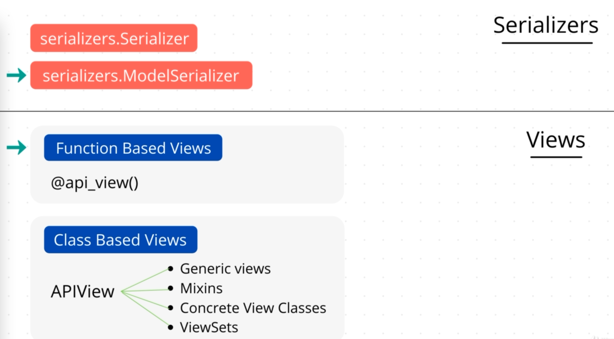

# Django

## 1. Install and setup 
1. `python3 -m venv <name>`

1. `source <name>/bin/activate `

1. ` pip install django`

## 2. Basic project commands
+ create project

`django-admin startproject <project name>`

+ start server

`python manage.py runserver`

+ Migrations 

`python manage.py migrate`
`python manage.py makemigrations`

+ SuperUser 

`python manage.py createsuperuser `

## create app

`cd <project name>`
`python manage.py startapp <app name>`

1. add app name inside project settings.py -> INSTALLED_APPS.
1. create urls.py.
1. create models.
1. use `makemigrations` and then `migrate`.
1. register model in admin.py -> admins.site.register(model_name)

# Django Restframework
## Install and setup
`pip install djangorestframework`
+ add 'rest_framework' into INSTALLED_APPS

## Serializers
<!--  -->
